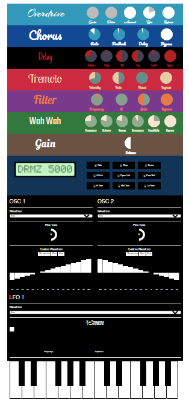

    

<h3 align="center">Web Audio API Synth</h3>

  <a href="../../issues">Report an Issue</a>
  ·
  <a href="../../releases">Releases</a>
  ·
  <a href="/CHANGELOG.md">Change Log</a>

  <a href="#Description">Description</a>
  ·
  <a href="#Roadmap">Roadmap</a>

## Description
Synth made from Web Audio API. Using [Tuna.js](https://github.com/Theodeus/tuna), [Kontrol.js](http://anthonyterrien.com/kontrol/) and [Qwerty.js](https://stuartmemo.com/qwerty-hancock/)

## Roadmap
Date | Issue | Status |
:--: | ----- | ------ |
20/05/2021 | Add start button to stop "The AudioContext was not allowed to start. It must be resumed (or created) after a user gesture on the page" warning | complete - 22/05/2021 |
20/05/2021 | Drum machine | completed - 22/05/2021 |
20/05/2021 | Make mobile friendly | incomplete |
20/05/2021 | Refactor, refactor, refactor | complete - 22/05/2021 |
